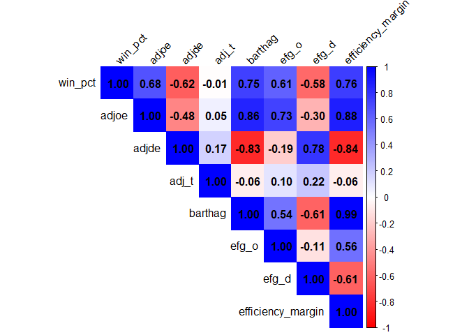

final_project_analysis
================
2026-04-26

``` r
cbb_raw <- read_csv("../data/cbb.csv")
```

    ## Rows: 4249 Columns: 24
    ## ── Column specification ────────────────────────────────────────────────────────
    ## Delimiter: ","
    ## chr  (4): TEAM, CONF, POSTSEASON, SEED
    ## dbl (20): G, W, ADJOE, ADJDE, BARTHAG, EFG_O, EFG_D, TOR, TORD, ORB, DRB, FT...
    ## 
    ## ℹ Use `spec()` to retrieve the full column specification for this data.
    ## ℹ Specify the column types or set `show_col_types = FALSE` to quiet this message.

``` r
glimpse(cbb_raw)
```

    ## Rows: 4,249
    ## Columns: 24
    ## $ TEAM       <chr> "North Carolina", "Wisconsin", "Michigan", "Texas Tech", "G…
    ## $ CONF       <chr> "ACC", "B10", "B10", "B12", "WCC", "SEC", "B10", "ACC", "AC…
    ## $ G          <dbl> 40, 40, 40, 38, 39, 40, 38, 39, 38, 39, 40, 40, 40, 40, 36,…
    ## $ W          <dbl> 33, 36, 33, 31, 37, 29, 30, 35, 35, 33, 35, 36, 32, 35, 27,…
    ## $ ADJOE      <dbl> 123.3, 129.1, 114.4, 115.2, 117.8, 117.2, 121.5, 125.2, 123…
    ## $ ADJDE      <dbl> 94.9, 93.6, 90.4, 85.2, 86.3, 96.2, 93.7, 90.6, 89.9, 91.5,…
    ## $ BARTHAG    <dbl> 0.9531, 0.9758, 0.9375, 0.9696, 0.9728, 0.9062, 0.9522, 0.9…
    ## $ EFG_O      <dbl> 52.6, 54.8, 53.9, 53.5, 56.6, 49.9, 54.6, 56.6, 55.2, 51.7,…
    ## $ EFG_D      <dbl> 48.1, 47.7, 47.7, 43.0, 41.1, 46.0, 48.0, 46.5, 44.7, 48.1,…
    ## $ TOR        <dbl> 15.4, 12.4, 14.0, 17.7, 16.2, 18.1, 14.6, 16.3, 14.7, 16.2,…
    ## $ TORD       <dbl> 18.2, 15.8, 19.5, 22.8, 17.1, 16.1, 18.7, 18.6, 17.5, 18.6,…
    ## $ ORB        <dbl> 40.7, 32.1, 25.5, 27.4, 30.0, 42.0, 32.5, 35.8, 30.4, 41.3,…
    ## $ DRB        <dbl> 30.0, 23.7, 24.9, 28.7, 26.2, 29.7, 29.4, 30.2, 25.4, 25.0,…
    ## $ FTR        <dbl> 32.3, 36.2, 30.7, 32.9, 39.0, 51.8, 28.4, 39.8, 29.1, 34.3,…
    ## $ FTRD       <dbl> 30.4, 22.4, 30.0, 36.6, 26.9, 36.8, 22.7, 23.9, 26.3, 31.6,…
    ## $ `2P_O`     <dbl> 53.9, 54.8, 54.7, 52.8, 56.3, 50.0, 53.4, 55.9, 52.5, 51.0,…
    ## $ `2P_D`     <dbl> 44.6, 44.7, 46.8, 41.9, 40.0, 44.9, 47.6, 46.3, 45.7, 46.3,…
    ## $ `3P_O`     <dbl> 32.7, 36.5, 35.2, 36.5, 38.2, 33.2, 37.9, 38.7, 39.5, 35.5,…
    ## $ `3P_D`     <dbl> 36.2, 37.5, 33.2, 29.7, 29.0, 32.2, 32.6, 31.4, 28.9, 33.9,…
    ## $ ADJ_T      <dbl> 71.7, 59.3, 65.9, 67.5, 71.5, 65.9, 64.8, 66.4, 60.7, 72.8,…
    ## $ WAB        <dbl> 8.6, 11.3, 6.9, 7.0, 7.7, 3.9, 6.2, 10.7, 11.1, 8.4, 8.9, 1…
    ## $ POSTSEASON <chr> "2ND", "2ND", "2ND", "2ND", "2ND", "2ND", "2ND", "Champions…
    ## $ SEED       <chr> "1", "1", "3", "3", "1", "8", "4", "1", "1", "1", "2", "1",…
    ## $ YEAR       <dbl> 2016, 2015, 2018, 2019, 2017, 2014, 2013, 2015, 2019, 2017,…

**Question 1:** Which team statistics are mostly strongly associated
with wins?

``` r
# Clean the data and create variables
cbb_clean <- cbb_raw %>%
  clean_names() %>%
  mutate(
    win_pct = w / g,
    efficiency_margin = adjoe - adjde
  ) %>%
  select(win_pct, adjoe, adjde, adj_t, barthag, efg_o, efg_d, efficiency_margin) %>%
  drop_na()

# Correlation matrix
numeric_vars <- cbb_clean %>%
  select(win_pct, adjoe, adjde, adj_t, barthag, efg_o, efg_d, efficiency_margin)

cor_matrix <- cor(numeric_vars)

cor_matrix
```

    ##                        win_pct       adjoe      adjde        adj_t     barthag
    ## win_pct            1.000000000  0.67977255 -0.6227412 -0.005380912  0.74918296
    ## adjoe              0.679772547  1.00000000 -0.4753384  0.053301412  0.85880299
    ## adjde             -0.622741180 -0.47533839  1.0000000  0.173549646 -0.83436967
    ## adj_t             -0.005380912  0.05330141  0.1735496  1.000000000 -0.06433129
    ## barthag            0.749182961  0.85880299 -0.8343697 -0.064331293  1.00000000
    ## efg_o              0.613377354  0.73055630 -0.1944235  0.104867801  0.54207415
    ## efg_d             -0.581155910 -0.29722693  0.7814493  0.216398165 -0.60582262
    ## efficiency_margin  0.759772930  0.87666231 -0.8399900 -0.062030208  0.98591223
    ##                        efg_o      efg_d efficiency_margin
    ## win_pct            0.6133774 -0.5811559        0.75977293
    ## adjoe              0.7305563 -0.2972269        0.87666231
    ## adjde             -0.1944235  0.7814493       -0.83998998
    ## adj_t              0.1048678  0.2163982       -0.06203021
    ## barthag            0.5420742 -0.6058226        0.98591223
    ## efg_o              1.0000000 -0.1128963        0.55687420
    ## efg_d             -0.1128963  1.0000000       -0.61063214
    ## efficiency_margin  0.5568742 -0.6106321        1.00000000

The correlation table provides numerical evidence of the relationships
between team statistics and win percentage. Consistent with the heatmap,
efficiency margin shows the strongest positive relationship with winning
(0.76), indicating that teams that outscore their opponents by larger
margins tend to be more successful. Offensive efficiency (0.68) also has
a strong positive association with win percentage, while defensive
efficiency (−0.62) has a strong negative relationship, meaning that
teams that allow fewer points perform better.

Additionally, BARTHAG has a high correlation with both win percentage
(0.75) and efficiency margin (0.99), reinforcing its role as a
comprehensive measure of team strength. Shooting efficiency metrics,
such as effective field goal percentage on offense (0.61) and defense
(−0.58), also show meaningful relationships with winning. In contrast,
adjusted tempo has almost no correlation with win percentage (−0.01),
suggesting that the pace of play does not significantly influence team
success.

``` r
# correlation plot
corrplot(
  cor_matrix,
  method = "color",
  type = "upper",
  col = colorRampPalette(c("red", "white", "blue"))(200),
  addCoef.col = "black",   # shows correlation numbers
  tl.col = "black",        # axis label color
  tl.srt = 45              # rotate labels
)
```

<!-- -->

**Figure 1:** Correlation between team statistics and win percentage

The heatmap shows that efficiency margin has the strongest relationship
with win percentage (0.76), indicating that teams that outscore
opponents by larger margins win more games. Offensive efficiency (0.68)
and defensive efficiency (−0.62) are both strongly related to winning,
with offense showing a slightly stronger association. BARTHAG is also
highly correlated with both efficiency margin and win percentage,
reinforcing its role as a composite performance metric. In contrast,
tempo exhibits near-zero correlation, suggesting that pace of play does
not significantly influence team success. Overall these results suggest
that team success is driven more by efficiency based performance than by
style of play.
