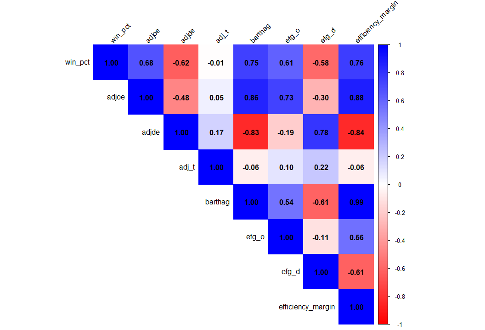
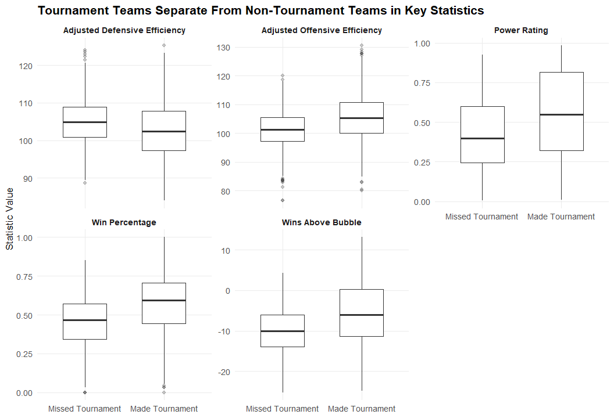
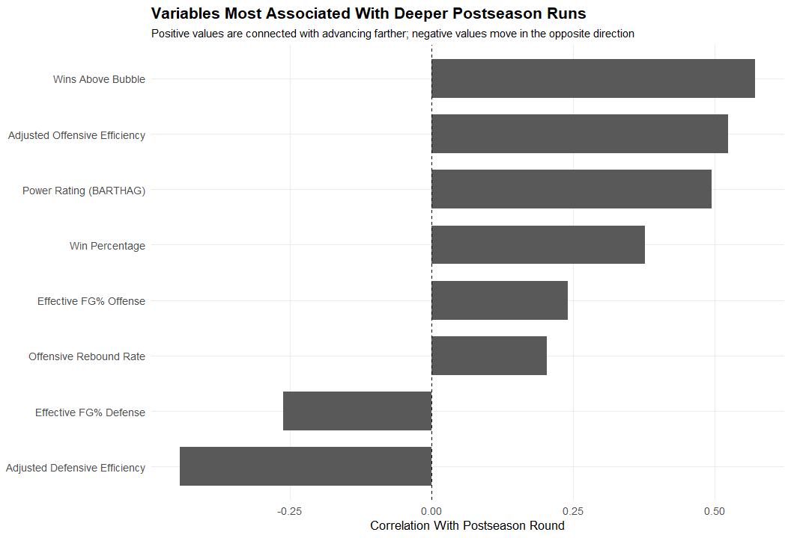
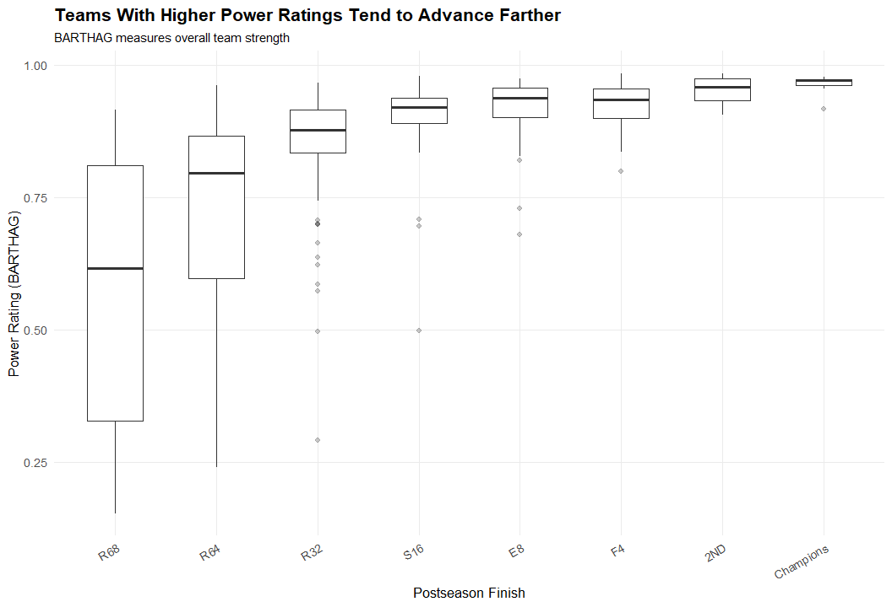
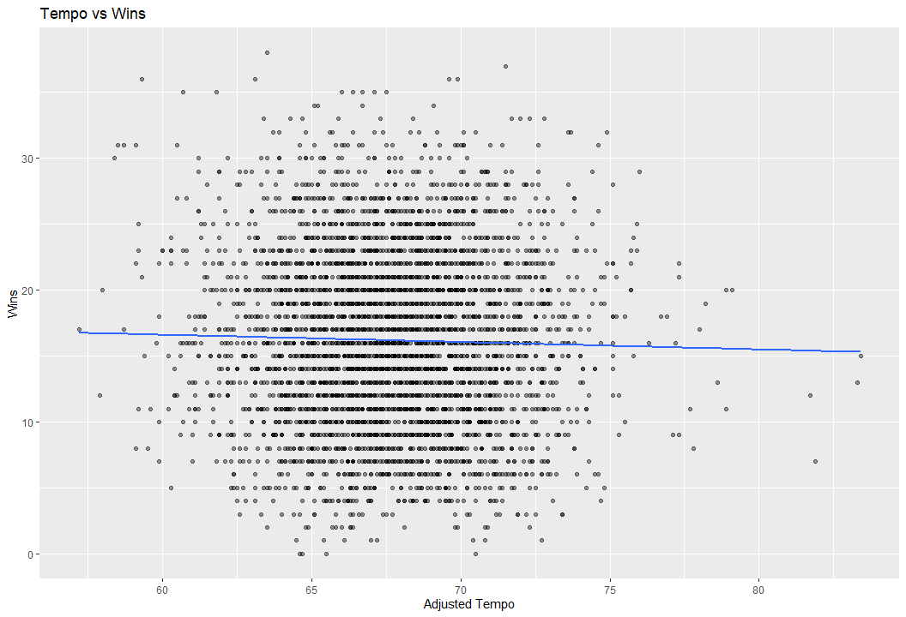
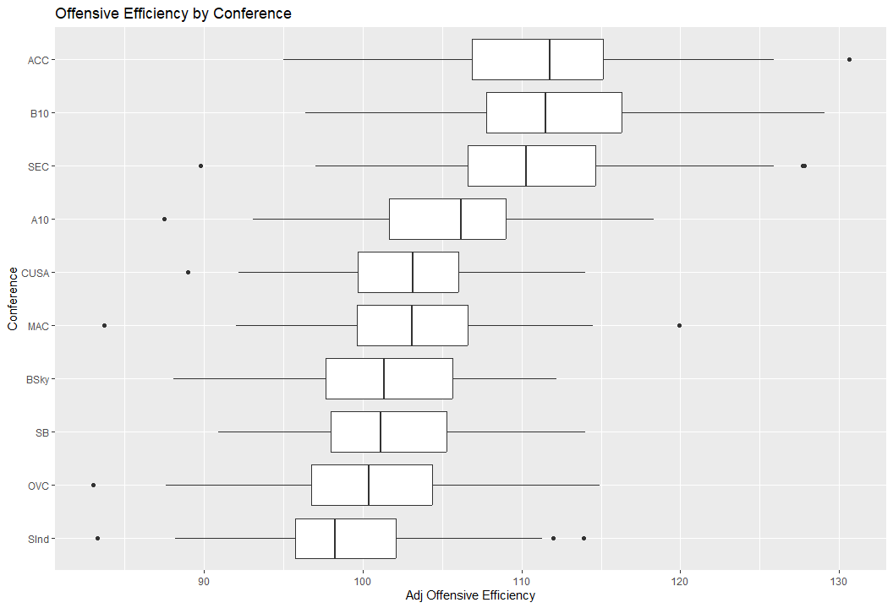

College Basketball Analysis
================
2026-04-26

#### Aniroop Naladala, Wyatt Sinclair, Abhinav Pillai, Alyvia Fager

## Introduction

The goal of this project is to explore team-level data to better
understand what drives success in college basketball. With the
increasing use of advanced analytics in sports, it is important to move
beyond basic statistics and examine how different performance metrics
contribute to winning. Analyzing these factors can provide insight into
team strengths, improve strategic decision-making, and highlight key
trends in the game.

In pursuit of this goal, we will explore the following questions:

1.  Which team statistics are most strongly associated with total wins?

2.  Is offensive efficiency or defensive efficiency more strongly
    related to win percentage?

3.  What statistics best distinguish teams that make the NCAA tournament
    from teams that do not?

4.  Which variables are most associated with deeper postseason runs?

5.  Does tempo relate to offensive success, defensive success, or
    overall wins?

6.  Do some conferences show consistently different statistical profiles
    than others?

These are the main questions we aim to answer through the completion of
this project. With our findings, we hope to better understand the key
characteristics that contribute to success in college basketball and
highlight the importance of efficiency-based metrics in evaluating team
performance.

## Data

### Structure

The dataset used in this project is the *College Basketball Dataset* by
Andrew Sundberg, available on Kaggle:
<https://www.kaggle.com/datasets/andrewsundberg/college-basketball-dataset>

This dataset contains statistics for Division I men’s college basketball
teams across multiple seasons. Each row represents a team in a given
season, and includes a wide range of variables related to team
performance. These variables include basic information such as team
name, conference, number of games played, and wins, as well as advanced
metrics such as offensive efficiency, defensive efficiency, tempo,
effective field goal percentage, strength of schedule, and postseason
results.

The number of variables in the dataset is large and covers multiple
aspects of team performance, making it well-suited for analyzing
different factors that contribute to success in college basketball.
Because the dataset spans multiple seasons and includes many teams, it
provides a comprehensive view of performance across the league.

In order to create a manageable and focused dataset for analysis, we
worked with a subset of the available variables. Rather than using every
column, we selected only those that were most relevant to our research
questions, such as efficiency metrics, shooting percentages, and
win-related statistics. This allowed us to reduce complexity while still
maintaining meaningful insights.

Each row in the dataset corresponds to a single team in a specific
season, meaning that the data is already structured at the team level.
This makes it easier to compare performance across teams and seasons
without needing to merge multiple files, unlike more complex datasets
that contain separate tables for different entities.

``` r
cbb_raw <- read_csv("../data/cbb.csv")

glimpse(cbb_raw)
```

    ## Rows: 4,249
    ## Columns: 24
    ## $ TEAM       <chr> "North Carolina", "Wisconsin", "Michigan", "Texas Tech", "G…
    ## $ CONF       <chr> "ACC", "B10", "B10", "B12", "WCC", "SEC", "B10", "ACC", "AC…
    ## $ G          <dbl> 40, 40, 40, 38, 39, 40, 38, 39, 38, 39, 40, 40, 40, 40, 36,…
    ## $ W          <dbl> 33, 36, 33, 31, 37, 29, 30, 35, 35, 33, 35, 36, 32, 35, 27,…
    ## $ ADJOE      <dbl> 123.3, 129.1, 114.4, 115.2, 117.8, 117.2, 121.5, 125.2, 123…
    ## $ ADJDE      <dbl> 94.9, 93.6, 90.4, 85.2, 86.3, 96.2, 93.7, 90.6, 89.9, 91.5,…
    ## $ BARTHAG    <dbl> 0.9531, 0.9758, 0.9375, 0.9696, 0.9728, 0.9062, 0.9522, 0.9…
    ## $ EFG_O      <dbl> 52.6, 54.8, 53.9, 53.5, 56.6, 49.9, 54.6, 56.6, 55.2, 51.7,…
    ## $ EFG_D      <dbl> 48.1, 47.7, 47.7, 43.0, 41.1, 46.0, 48.0, 46.5, 44.7, 48.1,…
    ## $ TOR        <dbl> 15.4, 12.4, 14.0, 17.7, 16.2, 18.1, 14.6, 16.3, 14.7, 16.2,…
    ## $ TORD       <dbl> 18.2, 15.8, 19.5, 22.8, 17.1, 16.1, 18.7, 18.6, 17.5, 18.6,…
    ## $ ORB        <dbl> 40.7, 32.1, 25.5, 27.4, 30.0, 42.0, 32.5, 35.8, 30.4, 41.3,…
    ## $ DRB        <dbl> 30.0, 23.7, 24.9, 28.7, 26.2, 29.7, 29.4, 30.2, 25.4, 25.0,…
    ## $ FTR        <dbl> 32.3, 36.2, 30.7, 32.9, 39.0, 51.8, 28.4, 39.8, 29.1, 34.3,…
    ## $ FTRD       <dbl> 30.4, 22.4, 30.0, 36.6, 26.9, 36.8, 22.7, 23.9, 26.3, 31.6,…
    ## $ `2P_O`     <dbl> 53.9, 54.8, 54.7, 52.8, 56.3, 50.0, 53.4, 55.9, 52.5, 51.0,…
    ## $ `2P_D`     <dbl> 44.6, 44.7, 46.8, 41.9, 40.0, 44.9, 47.6, 46.3, 45.7, 46.3,…
    ## $ `3P_O`     <dbl> 32.7, 36.5, 35.2, 36.5, 38.2, 33.2, 37.9, 38.7, 39.5, 35.5,…
    ## $ `3P_D`     <dbl> 36.2, 37.5, 33.2, 29.7, 29.0, 32.2, 32.6, 31.4, 28.9, 33.9,…
    ## $ ADJ_T      <dbl> 71.7, 59.3, 65.9, 67.5, 71.5, 65.9, 64.8, 66.4, 60.7, 72.8,…
    ## $ WAB        <dbl> 8.6, 11.3, 6.9, 7.0, 7.7, 3.9, 6.2, 10.7, 11.1, 8.4, 8.9, 1…
    ## $ POSTSEASON <chr> "2ND", "2ND", "2ND", "2ND", "2ND", "2ND", "2ND", "Champions…
    ## $ SEED       <chr> "1", "1", "3", "3", "1", "8", "4", "1", "1", "1", "2", "1",…
    ## $ YEAR       <dbl> 2016, 2015, 2018, 2019, 2017, 2014, 2013, 2015, 2019, 2017,…

## Question 1: Which team statistics are most strongly associated with wins?

#### Cleaning for Question 1:

``` r
# Clean the data and create variables
cbb_clean <- cbb_raw %>%
  clean_names() %>%
  mutate(
    win_pct = w / g,
    efficiency_margin = adjoe - adjde
  ) %>%
  select(win_pct, adjoe, adjde, adj_t, barthag, efg_o, efg_d, efficiency_margin) %>%
  drop_na()
```

To prepare the data for analysis, I first cleaned and simplified the
dataset. I used `clean_names()` to standardize all column names, making
them lowercase and easier to work with. Then, I created two new
variables: win percentage (`win_pct`), which measures team success more
accurately than total wins, and efficiency margin, which captures the
difference between offensive and defensive efficiency.

Next, I selected only the variables relevant to my analysis, focusing on
performance metrics such as offensive efficiency, defensive efficiency,
shooting efficiency, tempo, and overall team strength. Finally, I
removed any missing values using `drop_na()` to ensure that the analysis
was based on complete and consistent data.

Overall, these steps helped create a clean and focused dataset, making
the results more reliable and easier to interpret.

To answer this research question, I used correlation analysis to examine
the relationships between win percentage and key team statistics. This
method allows me to measure the strength and direction of association
between variables such as offensive efficiency, defensive efficiency,
and efficiency margin.

``` r
# Correlation matrix
numeric_vars <- cbb_clean %>%
  select(win_pct, adjoe, adjde, adj_t, barthag, efg_o, efg_d, efficiency_margin)

cor_matrix <- cor(numeric_vars)

knitr::kable(
  cor_matrix,
  digits = 2,
  caption = "Table 1: Correlation Matrix of Team Statistics"
) %>%
  kable_styling(
    full_width = FALSE,
    position = "center",
    bootstrap_options = c("striped", "hover", "condensed", "bordered")
  )
```

<table class="table table-striped table-hover table-condensed table-bordered" style="width: auto !important; margin-left: auto; margin-right: auto;">

<caption>

Table 1: Correlation Matrix of Team Statistics
</caption>

<thead>

<tr>

<th style="text-align:left;">

</th>

<th style="text-align:right;">

win_pct
</th>

<th style="text-align:right;">

adjoe
</th>

<th style="text-align:right;">

adjde
</th>

<th style="text-align:right;">

adj_t
</th>

<th style="text-align:right;">

barthag
</th>

<th style="text-align:right;">

efg_o
</th>

<th style="text-align:right;">

efg_d
</th>

<th style="text-align:right;">

efficiency_margin
</th>

</tr>

</thead>

<tbody>

<tr>

<td style="text-align:left;">

win_pct
</td>

<td style="text-align:right;">

1.00
</td>

<td style="text-align:right;">

0.68
</td>

<td style="text-align:right;">

-0.62
</td>

<td style="text-align:right;">

-0.01
</td>

<td style="text-align:right;">

0.75
</td>

<td style="text-align:right;">

0.61
</td>

<td style="text-align:right;">

-0.58
</td>

<td style="text-align:right;">

0.76
</td>

</tr>

<tr>

<td style="text-align:left;">

adjoe
</td>

<td style="text-align:right;">

0.68
</td>

<td style="text-align:right;">

1.00
</td>

<td style="text-align:right;">

-0.48
</td>

<td style="text-align:right;">

0.05
</td>

<td style="text-align:right;">

0.86
</td>

<td style="text-align:right;">

0.73
</td>

<td style="text-align:right;">

-0.30
</td>

<td style="text-align:right;">

0.88
</td>

</tr>

<tr>

<td style="text-align:left;">

adjde
</td>

<td style="text-align:right;">

-0.62
</td>

<td style="text-align:right;">

-0.48
</td>

<td style="text-align:right;">

1.00
</td>

<td style="text-align:right;">

0.17
</td>

<td style="text-align:right;">

-0.83
</td>

<td style="text-align:right;">

-0.19
</td>

<td style="text-align:right;">

0.78
</td>

<td style="text-align:right;">

-0.84
</td>

</tr>

<tr>

<td style="text-align:left;">

adj_t
</td>

<td style="text-align:right;">

-0.01
</td>

<td style="text-align:right;">

0.05
</td>

<td style="text-align:right;">

0.17
</td>

<td style="text-align:right;">

1.00
</td>

<td style="text-align:right;">

-0.06
</td>

<td style="text-align:right;">

0.10
</td>

<td style="text-align:right;">

0.22
</td>

<td style="text-align:right;">

-0.06
</td>

</tr>

<tr>

<td style="text-align:left;">

barthag
</td>

<td style="text-align:right;">

0.75
</td>

<td style="text-align:right;">

0.86
</td>

<td style="text-align:right;">

-0.83
</td>

<td style="text-align:right;">

-0.06
</td>

<td style="text-align:right;">

1.00
</td>

<td style="text-align:right;">

0.54
</td>

<td style="text-align:right;">

-0.61
</td>

<td style="text-align:right;">

0.99
</td>

</tr>

<tr>

<td style="text-align:left;">

efg_o
</td>

<td style="text-align:right;">

0.61
</td>

<td style="text-align:right;">

0.73
</td>

<td style="text-align:right;">

-0.19
</td>

<td style="text-align:right;">

0.10
</td>

<td style="text-align:right;">

0.54
</td>

<td style="text-align:right;">

1.00
</td>

<td style="text-align:right;">

-0.11
</td>

<td style="text-align:right;">

0.56
</td>

</tr>

<tr>

<td style="text-align:left;">

efg_d
</td>

<td style="text-align:right;">

-0.58
</td>

<td style="text-align:right;">

-0.30
</td>

<td style="text-align:right;">

0.78
</td>

<td style="text-align:right;">

0.22
</td>

<td style="text-align:right;">

-0.61
</td>

<td style="text-align:right;">

-0.11
</td>

<td style="text-align:right;">

1.00
</td>

<td style="text-align:right;">

-0.61
</td>

</tr>

<tr>

<td style="text-align:left;">

efficiency_margin
</td>

<td style="text-align:right;">

0.76
</td>

<td style="text-align:right;">

0.88
</td>

<td style="text-align:right;">

-0.84
</td>

<td style="text-align:right;">

-0.06
</td>

<td style="text-align:right;">

0.99
</td>

<td style="text-align:right;">

0.56
</td>

<td style="text-align:right;">

-0.61
</td>

<td style="text-align:right;">

1.00
</td>

</tr>

</tbody>

</table>

  
The correlation table provides numerical evidence of the relationships
between team statistics and win percentage. Consistent with the heatmap,
efficiency margin shows the strongest positive relationship with winning
(0.76), indicating that teams that outscore their opponents by larger
margins tend to be more successful. Offensive efficiency (0.68) also has
a strong positive association with win percentage, while defensive
efficiency (−0.62) has a strong negative relationship, meaning that
teams that allow fewer points perform better.

Additionally, BARTHAG has a high correlation with both win percentage
(0.75) and efficiency margin (0.99), reinforcing its role as a
comprehensive measure of team strength. Shooting efficiency metrics,
such as effective field goal percentage on offense (0.61) and defense
(−0.58), also show meaningful relationships with winning. In contrast,
adjusted tempo has almost no correlation with win percentage (−0.01),
suggesting that the pace of play does not significantly influence team
success.

Overall, these results suggest that team success is driven more by
efficiency-based performance metrics rather than style of play. Teams
that can consistently generate scoring advantages over their opponents
are far more likely to win games.

``` r
# correlation plot
corrplot(
  cor_matrix,
  method = "color",
  type = "upper",
  col = colorRampPalette(c("red", "white", "blue"))(200),
  addCoef.col = "black",   # shows correlation numbers
  tl.col = "black",        # axis label color
  tl.srt = 45              # rotate labels
)
```

<!-- -->

**Figure 1:** Correlation between team statistics and win percentage

The heatmap shows that efficiency margin has the strongest relationship
with win percentage (0.76), indicating that teams that outscore
opponents by larger margins win more games. Offensive efficiency (0.68)
and defensive efficiency (−0.62) are both strongly related to winning,
with offense showing a slightly stronger association. BARTHAG is also
highly correlated with both efficiency margin and win percentage,
reinforcing its role as a composite performance metric. In contrast,
tempo exhibits near-zero correlation, suggesting that pace of play does
not significantly influence team success.

In conclusion, the analysis clearly shows that efficiency-based metrics
are the strongest indicators of team success in college basketball.
Teams that consistently perform well on both offense and defense—and
ultimately achieve a high efficiency margin—are far more likely to win
games. In contrast, stylistic factors such as tempo have little to no
impact on overall success. This suggests that focusing on maximizing
scoring efficiency and minimizing opponent scoring is far more important
than the pace at which a team plays.

#### Cleaning for Question 3:

``` r
cbb_clean <- cbb_raw %>%
  clean_names() %>%
  mutate(
    # Create win percentage.
    # This should always be between 0 and 1.
    win_pct = w / g,
    
    # Create a tournament status variable.
    made_tournament = if_else(is.na(postseason) | postseason == "", "Missed Tournament", "Made Tournament"),
    
    # Put the categories in a logical order for graphs.
    made_tournament = factor(
      made_tournament,
      levels = c("Missed Tournament", "Made Tournament")
    )
  ) %>%
  # Remove impossible win percentages.
  # A team cannot win more games than it played.
  # I had noticed the my boxplot had teams with over a    
  # 100% win rate which should not be possible.
  filter(
    !is.na(win_pct),
    win_pct >= 0,
    win_pct <= 1
  )

glimpse(cbb_clean)
```

    ## Rows: 4,247
    ## Columns: 26
    ## $ team            <chr> "North Carolina", "Wisconsin", "Michigan", "Texas Tech…
    ## $ conf            <chr> "ACC", "B10", "B10", "B12", "WCC", "SEC", "B10", "ACC"…
    ## $ g               <dbl> 40, 40, 40, 38, 39, 40, 38, 39, 38, 39, 40, 40, 40, 40…
    ## $ w               <dbl> 33, 36, 33, 31, 37, 29, 30, 35, 35, 33, 35, 36, 32, 35…
    ## $ adjoe           <dbl> 123.3, 129.1, 114.4, 115.2, 117.8, 117.2, 121.5, 125.2…
    ## $ adjde           <dbl> 94.9, 93.6, 90.4, 85.2, 86.3, 96.2, 93.7, 90.6, 89.9, …
    ## $ barthag         <dbl> 0.9531, 0.9758, 0.9375, 0.9696, 0.9728, 0.9062, 0.9522…
    ## $ efg_o           <dbl> 52.6, 54.8, 53.9, 53.5, 56.6, 49.9, 54.6, 56.6, 55.2, …
    ## $ efg_d           <dbl> 48.1, 47.7, 47.7, 43.0, 41.1, 46.0, 48.0, 46.5, 44.7, …
    ## $ tor             <dbl> 15.4, 12.4, 14.0, 17.7, 16.2, 18.1, 14.6, 16.3, 14.7, …
    ## $ tord            <dbl> 18.2, 15.8, 19.5, 22.8, 17.1, 16.1, 18.7, 18.6, 17.5, …
    ## $ orb             <dbl> 40.7, 32.1, 25.5, 27.4, 30.0, 42.0, 32.5, 35.8, 30.4, …
    ## $ drb             <dbl> 30.0, 23.7, 24.9, 28.7, 26.2, 29.7, 29.4, 30.2, 25.4, …
    ## $ ftr             <dbl> 32.3, 36.2, 30.7, 32.9, 39.0, 51.8, 28.4, 39.8, 29.1, …
    ## $ ftrd            <dbl> 30.4, 22.4, 30.0, 36.6, 26.9, 36.8, 22.7, 23.9, 26.3, …
    ## $ x2p_o           <dbl> 53.9, 54.8, 54.7, 52.8, 56.3, 50.0, 53.4, 55.9, 52.5, …
    ## $ x2p_d           <dbl> 44.6, 44.7, 46.8, 41.9, 40.0, 44.9, 47.6, 46.3, 45.7, …
    ## $ x3p_o           <dbl> 32.7, 36.5, 35.2, 36.5, 38.2, 33.2, 37.9, 38.7, 39.5, …
    ## $ x3p_d           <dbl> 36.2, 37.5, 33.2, 29.7, 29.0, 32.2, 32.6, 31.4, 28.9, …
    ## $ adj_t           <dbl> 71.7, 59.3, 65.9, 67.5, 71.5, 65.9, 64.8, 66.4, 60.7, …
    ## $ wab             <dbl> 8.6, 11.3, 6.9, 7.0, 7.7, 3.9, 6.2, 10.7, 11.1, 8.4, 8…
    ## $ postseason      <chr> "2ND", "2ND", "2ND", "2ND", "2ND", "2ND", "2ND", "Cham…
    ## $ seed            <chr> "1", "1", "3", "3", "1", "8", "4", "1", "1", "1", "2",…
    ## $ year            <dbl> 2016, 2015, 2018, 2019, 2017, 2014, 2013, 2015, 2019, …
    ## $ win_pct         <dbl> 0.8250000, 0.9000000, 0.8250000, 0.8157895, 0.9487179,…
    ## $ made_tournament <fct> Made Tournament, Made Tournament, Made Tournament, Mad…

# Research Question 3

What statistics best distinguish teams that make the NCAA tournament
from teams that do not?

``` r
# Summarize the average values for tournament and non-tournament teams.
# This gives us a simple table to compare both groups.
q3_summary <- cbb_clean %>%
  group_by(made_tournament) %>%
  summarise(
    number_of_teams = n(),
    average_wins = mean(w, na.rm = TRUE),
    average_win_pct = mean(win_pct, na.rm = TRUE),
    average_offense = mean(adjoe, na.rm = TRUE),
    average_defense = mean(adjde, na.rm = TRUE),
    average_power_rating = mean(barthag, na.rm = TRUE),
    average_wab = mean(wab, na.rm = TRUE),
    .groups = "drop"
  )

# Print the summary table in a clean format.
q3_summary %>%
  kable(
    digits = 3,
    caption = "Average statistics for tournament and non-tournament teams"
  )
```

| made_tournament | number_of_teams | average_wins | average_win_pct | average_offense | average_defense | average_power_rating | average_wab |
|:---|---:|---:|---:|---:|---:|---:|---:|
| Missed Tournament | 1979 | 14.274 | 0.458 | 101.332 | 104.904 | 0.421 | -10.019 |
| Made Tournament | 2268 | 17.832 | 0.572 | 105.623 | 102.514 | 0.556 | -5.695 |

Average statistics for tournament and non-tournament teams

``` r
# Put the main statistics into a longer format.
# This makes it easier to create one faceted plot with several statistics.
q3_long <- cbb_clean %>%
  select(
    made_tournament,
    win_pct,
    adjoe,
    adjde,
    barthag,
    wab
  ) %>%
  pivot_longer(
    cols = c(win_pct, adjoe, adjde, barthag, wab),
    names_to = "statistic",
    values_to = "value"
  ) %>%
  mutate(
    # Rename the variables so the plot labels are easier to understand.
    statistic = recode(
      statistic,
      win_pct = "Win Percentage",
      adjoe = "Adjusted Offensive Efficiency",
      adjde = "Adjusted Defensive Efficiency",
      barthag = "Power Rating",
      wab = "Wins Above Bubble"
    )
  )


# Make a faceted boxplot to compare several statistics at once.
# facet_wrap makes a separate small plot for each statistic.
ggplot(q3_long, aes(x = made_tournament, y = value)) +
  geom_boxplot(
    width = 0.55,
    outlier.alpha = 0.25
  ) +
  facet_wrap(~ statistic, scales = "free_y") +
  labs(
    title = "Tournament Teams Separate From Non-Tournament Teams in Key Statistics",
    x = NULL,
    y = "Statistic Value",
  ) +
  theme_minimal(base_size = 13) +
  theme(
    plot.title = element_text(face = "bold"),
    plot.subtitle = element_text(size = 11),
    strip.text = element_text(face = "bold"),
    panel.grid.minor = element_blank()
  )
```

<!-- -->

``` r
# Create a smaller dataset with just the two statistics we want.
q3_two_stats <- cbb_clean %>%
  select(made_tournament, win_pct, barthag) %>%
  pivot_longer(
    cols = c(win_pct, barthag),
    names_to = "statistic",
    values_to = "value"
  ) %>%
  mutate(
    statistic = recode(
      statistic,
      win_pct = "Win Percentage",
      barthag = "Power Rating (BARTHAG)"
    )
  )

# Build the graph.
ggplot(q3_two_stats, aes(x = made_tournament, y = value)) +
  geom_boxplot(
    width = 0.55,
    outlier.alpha = 0.25
  ) +
  facet_wrap(~ statistic, scales = "free_y") +
  labs(
    title = "Tournament Teams Usually Have Higher Win Percentages and Power Ratings",
    x = NULL,
    y = "Value"
  ) +
  theme_minimal(base_size = 13) +
  theme(
    plot.title = element_text(face = "bold"),
    plot.subtitle = element_text(size = 11),
    strip.text = element_text(face = "bold"),
    panel.grid.minor = element_blank()
  )
```

<!-- -->

Comments: This shows that teams with a higher win percentage are more
likely to make the tournament and I believe this is a strongest factor.
Teams that made the tournament had a noticeably higher win percentage
than teams that did not. This makes sense because you typically need
over a .500 win percentage to make the tournament. Teams with a higher
BARTHAG value means that there team was stronger overall. These two
things winning consistently and being highly rated overall are strong
indicators of making the mens NCAA tournament.

# Research Question 4

Which variables are most associated with deeper postseason runs?

``` r
# For this question, we only want teams that made the NCAA tournament.
# The postseason column tells us how far each team advanced.
postseason_clean <- cbb_clean %>%
  filter(!is.na(postseason), postseason != "N/A", postseason != "") %>%
  mutate(
    # Create a numeric variable for tournament depth.
    # Bigger numbers mean the team went farther in the tournament.
    postseason_round = case_when(
      postseason == "R68" ~ 1,
      postseason == "R64" ~ 2,
      postseason == "R32" ~ 3,
      postseason == "S16" ~ 4,
      postseason == "E8" ~ 5,
      postseason == "F4" ~ 6,
      postseason == "2ND" ~ 7,
      postseason == "Champions" ~ 8,
      TRUE ~ NA_real_
    ),
    
    # Create an ordered factor so the graph puts the rounds in the correct order.
    postseason_label = factor(
      postseason,
      levels = c("R68", "R64", "R32", "S16", "E8", "F4", "2ND", "Champions"),
      ordered = TRUE
    )
  ) %>%
  filter(!is.na(postseason_round))

# Check how many teams are in each postseason group.
postseason_clean %>%
  count(postseason_label) %>%
  kable(caption = "Number of teams by postseason finish")
```

| postseason_label |   n |
|:-----------------|----:|
| R68              |  48 |
| R64              | 383 |
| R32              | 192 |
| S16              |  96 |
| E8               |  48 |
| F4               |  24 |
| 2ND              |  12 |
| Champions        |  12 |

Number of teams by postseason finish

``` r
# This table checks which variables have the strongest relationship
# with deeper tournament runs.
# A positive correlation means higher values are connected with going farther.
# A negative correlation means lower values are connected with going farther.
q4_correlations <- postseason_clean %>%
  select(
    postseason_round,
    win_pct,
    adjoe,
    adjde,
    barthag,
    wab,
    efg_o,
    efg_d,
    tor,
    tord,
    orb,
    drb,
    ftr,
    ftrd,
    adj_t
  ) %>%
  pivot_longer(
    cols = -postseason_round,
    names_to = "variable",
    values_to = "value"
  ) %>%
  group_by(variable) %>%
  summarise(
    correlation = cor(value, postseason_round, use = "complete.obs"),
    abs_correlation = abs(correlation),
    .groups = "drop"
  ) %>%
  arrange(desc(abs_correlation))

# Print the correlation table with readable variable names.
q4_correlations %>%
  mutate(
    variable = recode(
      variable,
      win_pct = "Win Percentage",
      adjoe = "Adjusted Offensive Efficiency",
      adjde = "Adjusted Defensive Efficiency",
      barthag = "Power Rating (BARTHAG)",
      wab = "Wins Above Bubble",
      efg_o = "Effective FG% Offense",
      efg_d = "Effective FG% Defense",
      tor = "Turnover Rate Offense",
      tord = "Turnover Rate Defense",
      orb = "Offensive Rebound Rate",
      drb = "Defensive Rebound Rate",
      ftr = "Free Throw Rate Offense",
      ftrd = "Free Throw Rate Defense",
      adj_t = "Adjusted Tempo"
    )
  ) %>%
  select(variable, correlation) %>%
  kable(
    digits = 3,
    caption = "Correlation between team statistics and deeper postseason runs"
  )
```

| variable                      | correlation |
|:------------------------------|------------:|
| Wins Above Bubble             |       0.573 |
| Adjusted Offensive Efficiency |       0.525 |
| Power Rating (BARTHAG)        |       0.496 |
| Adjusted Defensive Efficiency |      -0.445 |
| Win Percentage                |       0.378 |
| Effective FG% Defense         |      -0.262 |
| Effective FG% Offense         |       0.241 |
| Offensive Rebound Rate        |       0.204 |
| Turnover Rate Offense         |      -0.201 |
| Free Throw Rate Defense       |      -0.157 |
| Free Throw Rate Offense       |      -0.080 |
| Defensive Rebound Rate        |      -0.042 |
| Adjusted Tempo                |      -0.035 |
| Turnover Rate Defense         |       0.018 |

Correlation between team statistics and deeper postseason runs

``` r
# This graph shows the eight variables most associated with deeper postseason runs.
# We use absolute correlation to find the strongest relationships,
# whether they are positive or negative.
q4_correlations %>%
  slice_max(abs_correlation, n = 8) %>%
  mutate(
    variable = recode(
      variable,
      win_pct = "Win Percentage",
      adjoe = "Adjusted Offensive Efficiency",
      adjde = "Adjusted Defensive Efficiency",
      barthag = "Power Rating (BARTHAG)",
      wab = "Wins Above Bubble",
      efg_o = "Effective FG% Offense",
      efg_d = "Effective FG% Defense",
      tor = "Turnover Rate Offense",
      tord = "Turnover Rate Defense",
      orb = "Offensive Rebound Rate",
      drb = "Defensive Rebound Rate",
      ftr = "Free Throw Rate Offense",
      ftrd = "Free Throw Rate Defense",
      adj_t = "Adjusted Tempo"
    ),
    
    # Reorder the bars so the plot is easier to read.
    variable = fct_reorder(variable, correlation)
  ) %>%
  ggplot(aes(x = correlation, y = variable)) +
  geom_col(width = 0.7) +
  geom_vline(xintercept = 0, linetype = "dashed") +
  labs(
    title = "Variables Most Associated With Deeper Postseason Runs",
    subtitle = "Positive values are connected with advancing farther; negative values move in the opposite direction",
    x = "Correlation With Postseason Round",
    y = NULL
  ) +
  theme_minimal(base_size = 13) +
  theme(
    plot.title = element_text(face = "bold"),
    plot.subtitle = element_text(size = 11),
    panel.grid.minor = element_blank()
  )
```

<!-- -->

``` r
# This boxplot focuses on BARTHAG, which measures overall team strength.
# We compare BARTHAG across each postseason finish.
ggplot(postseason_clean, aes(x = postseason_label, y = barthag)) +
  geom_boxplot(
    width = 0.55,
    outlier.alpha = 0.25
  ) +
  labs(
    title = "Teams With Higher Power Ratings Tend to Advance Farther",
    subtitle = "BARTHAG measures overall team strength",
    x = "Postseason Finish",
    y = "Power Rating (BARTHAG)"
  ) +
  theme_minimal(base_size = 13) +
  theme(
    plot.title = element_text(face = "bold"),
    plot.subtitle = element_text(size = 11),
    axis.text.x = element_text(angle = 30, hjust = 1),
    panel.grid.minor = element_blank()
  )
```

<!-- -->

## Question 5: Does tempo relate to offensive success, defensive success, or overall wins?

``` r
names(cbb_raw)
```

    ##  [1] "TEAM"       "CONF"       "G"          "W"          "ADJOE"     
    ##  [6] "ADJDE"      "BARTHAG"    "EFG_O"      "EFG_D"      "TOR"       
    ## [11] "TORD"       "ORB"        "DRB"        "FTR"        "FTRD"      
    ## [16] "2P_O"       "2P_D"       "3P_O"       "3P_D"       "ADJ_T"     
    ## [21] "WAB"        "POSTSEASON" "SEED"       "YEAR"

``` r
cbb <- cbb_raw %>%
  clean_names() %>%
  drop_na(adj_t, adjoe, adjde, w)

cbb %>%
  select(adj_t, adjoe, adjde, w) %>%
  cor()
```

    ##             adj_t       adjoe      adjde           w
    ## adj_t  1.00000000  0.05330141  0.1735496 -0.02566581
    ## adjoe  0.05330141  1.00000000 -0.4753384  0.73167414
    ## adjde  0.17354965 -0.47533839  1.0000000 -0.63882774
    ## w     -0.02566581  0.73167414 -0.6388277  1.00000000

- Interpretation: The correlation analysis shows that tempo (adj_t) has
  almost no relationship with total wins (r = -0.026), indicating that
  playing faster or slower does not significantly impact team success.
  Tempo also has a very weak positive relationship with offensive
  efficiency (r = 0.053), suggesting that faster teams are not
  substantially more effective offensively.

Additionally, tempo has a weak positive relationship with defensive
efficiency (r = 0.174). Because higher defensive efficiency values
indicate worse defense, this suggests that faster-paced teams may
perform slightly worse defensively.

In contrast, offensive and defensive efficiency are strongly associated
with wins. Offensive efficiency has a strong positive correlation with
wins (r = 0.732), while defensive efficiency has a strong negative
correlation with wins (r = -0.639). These results indicate that
efficiency metrics are much more important predictors of success than
tempo.

``` r
#Tempo vs Offensive Efficiency
ggplot(cbb, aes(x = adj_t, y = adjoe)) +
  geom_point(alpha = 0.4) +
  geom_smooth(method = "lm", se = FALSE) +
  labs(
    title = "Tempo vs Offensive Efficiency",
    x = "Adjusted Tempo",
    y = "Adjusted Offensive Efficiency"
  )
```

<!-- -->

- The scatterplot shows a very slight positive trend between tempo and
  offensive efficiency, but the relationship is weak and the data points
  are widely scattered. This suggests that tempo does not strongly
  influence offensive performance.

``` r
#Tempo vs Defensive Efficiency
ggplot(cbb, aes(x = adj_t, y = adjde)) +
  geom_point(alpha = 0.4) +
  geom_smooth(method = "lm", se = FALSE) +
  labs(
    title = "Tempo vs Defensive Efficiency",
    x = "Adjusted Tempo",
    y = "Adjusted Defensive Efficiency"
  )
```

<!-- -->

- The plot shows a slight upward trend, indicating that higher tempo is
  associated with higher defensive efficiency values. Since higher
  values represent worse defense, this suggests that faster paced teams
  may allow more efficient scoring by opponents, although the
  relationship remains weak.

``` r
#Tempo vs Wins
ggplot(cbb, aes(x = adj_t, y = w)) +
  geom_point(alpha = 0.4) +
  geom_smooth(method = "lm", se = FALSE) +
  labs(
    title = "Tempo vs Wins",
    x = "Adjusted Tempo",
    y = "Wins"
  )
```

<!-- -->

- The scatterplot shows no clear trend between tempo and total wins. The
  regression line is nearly flat, reinforcing the conclusion that tempo
  does not meaningfully impact overall team success.

``` r
#Regression Analysis
model <- lm(w ~ adj_t + adjoe + adjde, data = cbb)
summary(model)
```

    ## 
    ## Call:
    ## lm(formula = w ~ adj_t + adjoe + adjde, data = cbb)
    ## 
    ## Residuals:
    ##      Min       1Q   Median       3Q      Max 
    ## -13.7266  -2.6421  -0.0779   2.7031  12.4009 
    ## 
    ## Coefficients:
    ##              Estimate Std. Error t value Pr(>|t|)    
    ## (Intercept)  3.334465   1.990931   1.675    0.094 .  
    ## adj_t        0.023226   0.020430   1.137    0.256    
    ## adjoe        0.483675   0.009239  52.354   <2e-16 ***
    ## adjde       -0.374902   0.010565 -35.485   <2e-16 ***
    ## ---
    ## Signif. codes:  0 '***' 0.001 '**' 0.01 '*' 0.05 '.' 0.1 ' ' 1
    ## 
    ## Residual standard error: 3.873 on 4245 degrees of freedom
    ## Multiple R-squared:  0.6449, Adjusted R-squared:  0.6446 
    ## F-statistic:  2570 on 3 and 4245 DF,  p-value: < 2.2e-16

The regression analysis further reinforces the findings from the
correlation and visualization results. Tempo (adj_t) is not a
statistically significant predictor of wins (p = 0.256), indicating that
pace of play does not meaningfully impact team success when controlling
for efficiency metrics.

In contrast, both offensive and defensive efficiency are highly
significant predictors of wins. Offensive efficiency (adjoe) has a
strong positive effect, with a coefficient of 0.484, suggesting that
increases in scoring efficiency are associated with higher win totals.
Defensive efficiency (adjde) has a strong negative effect, with a
coefficient of -0.375. Because higher defensive efficiency values
indicate worse defense, this result shows that better defensive
performance is strongly associated with more wins.

The model explains approximately 64.5% of the variation in total wins
(R² = 0.645), indicating a strong overall fit. These results confirm
that team efficiency, rather than tempo, is the primary driver of
success in college basketball.

Conclusion: Overall, the analysis shows that tempo has little to no
meaningful relationship with offensive success, defensive success, or
total wins in college basketball. While there is a slight tendency for
faster teams to have worse defensive efficiency, the relationship is
weak and not a major factor in determining outcomes. In contrast, both
offensive and defensive efficiency are strongly associated with winning,
and regression results confirm that these metrics are the primary
drivers of success. This suggests that tempo influences a team’s style
of play rather than its effectiveness, as teams can succeed at both fast
and slow paces as long as they are efficient offensively and
defensively.

## Question 6: Do some conferences show consistently different statistical profiles than others?

To examine whether conferences exhibit different statistical profiles,
we compare average tempo, offensive efficiency, defensive efficiency,
and wins across conferences using summary statistics and visualizations.

``` r
cbb <- cbb_raw %>%
  clean_names()

#summary table
conf_summary <- cbb %>%
  group_by(conf) %>%
  summarise(
    avg_tempo = mean(adj_t, na.rm = TRUE),
    avg_offense = mean(adjoe, na.rm = TRUE),
    avg_defense = mean(adjde, na.rm = TRUE),
    avg_wins = mean(w, na.rm = TRUE),
    teams = n()
  ) %>%
  arrange(desc(avg_wins))

kable(conf_summary)
```

| conf | avg_tempo | avg_offense | avg_defense | avg_wins | teams |
|:-----|----------:|------------:|------------:|---------:|------:|
| B12  |  67.68692 |   112.53846 |    95.43846 | 20.53846 |   130 |
| B10  |  67.08036 |   111.97381 |    96.38571 | 19.94048 |   168 |
| SEC  |  68.08000 |   110.68647 |    96.90118 | 19.55294 |   170 |
| ACC  |  67.14556 |   111.31722 |    97.80722 | 19.47778 |   180 |
| BE   |  67.71923 |   111.12923 |    97.16462 | 19.45385 |   130 |
| P12  |  67.96136 |   108.98712 |    98.18712 | 18.78030 |   132 |
| Amer |  67.50630 |   106.71890 |   100.16929 | 17.83465 |   127 |
| MWC  |  67.27769 |   106.16231 |   100.85846 | 17.57692 |   130 |
| WCC  |  67.67899 |   107.04538 |   101.69328 | 17.35294 |   119 |
| A10  |  67.53721 |   105.60058 |   100.70872 | 17.30233 |   172 |
| MVC  |  66.61270 |   104.27381 |   101.60952 | 17.22222 |   126 |
| Ind  |  67.10000 |   103.30000 |   104.50000 | 17.00000 |     1 |
| CUSA |  67.86474 |   102.69615 |   103.14295 | 16.73077 |   156 |
| MAC  |  68.06042 |   103.16181 |   104.80139 | 16.25694 |   144 |
| SB   |  67.79034 |   101.79517 |   104.37448 | 15.98621 |   145 |
| SC   |  67.71138 |   102.46423 |   106.60813 | 15.64228 |   123 |
| WAC  |  67.99217 |   100.58783 |   104.07478 | 15.53913 |   115 |
| CAA  |  67.02214 |   103.06641 |   105.96565 | 15.52672 |   131 |
| Horz |  68.12339 |   102.15323 |   106.24597 | 15.16935 |   124 |
| Sum  |  67.93364 |   103.12430 |   107.52243 | 15.00935 |   107 |
| BW   |  67.39664 |   101.37059 |   104.56471 | 14.95798 |   119 |
| MAAC |  67.68346 |   100.34511 |   105.49699 | 14.92481 |   133 |
| OVC  |  68.11522 |   100.51739 |   107.12029 | 14.81884 |   138 |
| ASun |  68.06471 |   101.34622 |   108.40588 | 14.61345 |   119 |
| BSth |  67.35116 |   100.45736 |   107.59612 | 14.53488 |   129 |
| BSky |  67.76791 |   101.41791 |   108.24403 | 14.42537 |   134 |
| Ivy  |  67.50568 |   102.77045 |   104.37159 | 14.40909 |    88 |
| AE   |  67.34273 |    98.81818 |   106.47727 | 14.38182 |   110 |
| Pat  |  66.85000 |    99.96695 |   106.88390 | 14.19492 |   118 |
| Slnd |  68.68592 |    98.87042 |   108.69789 | 13.76761 |   142 |
| NEC  |  67.96050 |    97.64706 |   108.64034 | 13.36975 |   119 |
| MEAC |  68.58779 |    94.66031 |   109.21679 | 12.03817 |   131 |
| SWAC |  68.22656 |    93.66797 |   109.46094 | 11.67969 |   128 |
| GWC  |  66.44000 |    91.24000 |   104.70000 | 10.40000 |     5 |
| ind  |  66.96667 |    94.11667 |   110.65000 |  8.50000 |     6 |

- Interpretation: The summary statistics reveal clear differences in
  statistical profiles across conferences. Power conferences such as the
  Big 12, Big Ten, SEC, ACC, and Big East consistently demonstrate
  higher average wins, stronger offensive efficiency, and better
  defensive performance compared to other conferences. In particular,
  the Big 12 stands out with the highest average offensive efficiency
  and win totals, indicating a strong overall competitive profile.

Mid-tier conferences such as the Pac-12, American, and Mountain West
show slightly lower offensive efficiency and weaker defensive
performance, resulting in fewer average wins. Lower-tier conferences,
including the MEAC and SWAC, exhibit substantially lower offensive
efficiency and worse defensive metrics, which correspond to
significantly lower win totals.

Interestingly, tempo remains relatively consistent across all
conferences, with average values clustered closely between 66 and 68
possessions per game. This suggests that differences in team success
across conferences are driven primarily by efficiency rather than pace
of play.

``` r
top_conf <- cbb %>%
  count(conf, sort = TRUE) %>%
  slice_head(n = 10) %>%
  pull(conf)

cbb_top <- cbb %>%
  filter(conf %in% top_conf)

#Offensive Efficiency 
ggplot(cbb_top, aes(x = reorder(conf, adjoe, median), y = adjoe)) +
  geom_boxplot() +
  coord_flip() +
  labs(title = "Offensive Efficiency by Conference",
       x = "Conference",
       y = "Adj Offensive Efficiency")
```

<!-- -->

- Interpretation: The boxplot shows that power conferences such as the
  ACC, Big Ten, and SEC have higher median offensive efficiency than
  other conferences, indicating stronger scoring ability. Lower-tier
  conferences tend to have lower median values, reflecting weaker
  offensive performance. While there is some overlap, the overall
  distribution suggests that teams in stronger conferences consistently
  perform better offensively.

``` r
#Defensive Efficiency
ggplot(cbb_top, aes(x = reorder(conf, adjde, median), y = adjde)) +
  geom_boxplot() +
  coord_flip() +
  labs(
    title = "Defensive Efficiency by Conference",
    x = "Conference",
    y = "Adj Defensive Efficiency"
  )
```

<!-- -->

- Interpretation: The boxplot shows that power conferences such as the
  Big Ten, SEC, and ACC have lower median defensive efficiency values,
  indicating stronger defensive performance. In contrast, lower-tier
  conferences such as the Southland and Big Sky have higher values,
  reflecting weaker defense. Overall, the distribution suggests that
  stronger conferences consistently perform better defensively.

``` r
#Tempo
ggplot(cbb_top, aes(x = reorder(conf, adj_t, median), y = adj_t)) +
  geom_boxplot() +
  coord_flip() +
  labs(title = "Tempo by Conference",
       x = "Conference",
       y = "Adjusted Tempo")
```

<!-- -->

- Interpretation: The boxplot shows that tempo is very similar across
  all conferences, with median values clustered in a narrow range and
  comparable variability. Unlike offensive and defensive efficiency,
  there are no clear differences between conferences, suggesting that
  tempo does not distinguish stronger and weaker conferences.

Taken together, the visualizations show clear differences in offensive
and defensive efficiency across conferences, with power conferences
consistently outperforming others. In contrast, tempo remains relatively
uniform across all conferences, suggesting that differences in team
success are driven by efficiency rather than pace of play.

- Conclusion: Overall, the analysis demonstrates that conferences
  exhibit consistently different statistical profiles. Power conferences
  tend to have more efficient offenses, stronger defenses, and higher
  win totals, while lower-tier conferences show weaker performance
  across these metrics. Despite these differences, tempo remains largely
  consistent across conferences, reinforcing the conclusion that pace of
  play does not significantly distinguish team success. These findings
  suggest that conference affiliation is strongly associated with team
  quality and performance characteristics in college basketball.
